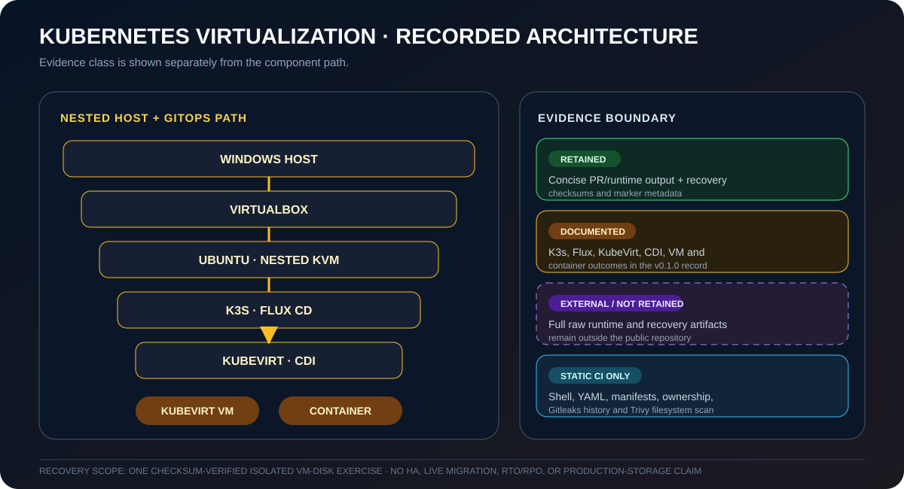

# FluxVirt Lab

> A reproducible Kubernetes virtualization lab where Flux CD reconciles KubeVirt virtual machines and hardened containers on a single-node K3s cluster.

The published v0.1.0 record (2026-07-27) documents the Windows 11 Home → VirtualBox → Ubuntu → nested KVM path, VM/container acceptance, and one checksum-verified isolated VM-disk recovery exercise. [PR #3](https://github.com/goozcena-gnl/fluxvirt-lab/pull/3) retains concise runtime output and the recovery guide retains run-specific checksum and marker metadata; the full raw artifacts remain outside the repository.

[](https://github.com/goozcena-gnl/fluxvirt-lab/actions/workflows/ci.yaml)
[](https://github.com/goozcena-gnl/fluxvirt-lab/actions/workflows/validate.yml)
[](https://github.com/goozcena-gnl/fluxvirt-lab/releases/latest)

Evidence: [dated reconciliation](VALIDATION.md), [published release](https://github.com/goozcena-gnl/fluxvirt-lab/releases/tag/v0.1.0), and [bounded recovery record](docs/BACKUP-RESTORE.md).

<p align="center">
  
</p>

<p align="center"><sub><strong>Recorded architecture + evidence classes.</strong> The diagram preserves the distinction between concise retained records, documented runtime outcomes, full raw artifacts held externally, and repository-only static CI.</sub></p>

Oracle VirtualBox runs an Ubuntu Server virtual machine with nested
hardware virtualization. Ubuntu hosts a single-node K3s cluster where
Flux CD reconciles KubeVirt, CDI, an Ubuntu virtual machine and a
hardened container workload from Git.

## Capabilities

- validating native VT-x, SLAT and nested KVM on Windows 11 Home;
- provisioning a repeatable VirtualBox and Ubuntu environment;
- operating Kubernetes virtual machines and containers together;
- dependency-ordered GitOps reconciliation with Flux CD;
- persistent VM storage through CDI DataVolumes and PVCs;
- cloud-init guest configuration and QEMU Guest Agent integration;
- repository validation with ShellCheck, yamllint and Kubeconform;
- Gitleaks and Trivy security scanning;
- protected-branch governance and pull-request-only changes;
- a manually executed, checksum-verified VM-disk backup and isolated restore
  lifecycle;
- evidence-based runtime acceptance rather than configuration-only claims.

## v0.1.0 recorded architecture

```text
Windows 11 Home x86_64
└── Oracle VirtualBox 7.2.14
    └── Ubuntu Server 24.04.4 LTS
        ├── nested KVM: /dev/kvm
        └── K3s v1.35.6+k3s1
            ├── Flux CD v2.9.2
            ├── KubeVirt v1.8.4
            ├── CDI v1.65.0
            ├── Ubuntu 24.04 KubeVirt VM
            └── hardened container demo
```

See [Architecture](docs/ARCHITECTURE.md) for the component and
reconciliation diagrams.

## v0.1.0 evidence summary

| Capability | Recorded result |
|---|---|
| Windows host mode | Microsoft hypervisor disabled in the dedicated lab boot |
| VirtualBox | Nested hardware virtualization enabled |
| Ubuntu | `/dev/kvm` available and usable |
| Kubernetes | Single K3s node `Ready` |
| Flux CD | All declared Kustomizations `Ready` |
| KubeVirt | Available with allocatable KVM devices |
| CDI | DataVolume import succeeded and PVC bound |
| Recovery exercise | SHA-256-verified VM-disk backup, read-only offline marker verification, isolated restored-VM boot, exact HTTP verification, cleanup, and healthy protected source |
| Virtual machine | Ubuntu guest `Running` and `Ready` |
| Guest integration | QEMU Guest Agent connected |
| VM service | Nginx page reachable through NodePort |
| Container | Hardened HTTP workload `Ready` and reachable |
| Static CI | Shell, YAML, manifests and ownership validated |
| Security CI | Gitleaks history scan and Trivy filesystem scan |
| Governance | Protected `main`, required PRs and required CI checks |

## Quick verification

Run inside the Ubuntu lab VM:

```bash
./scripts/validation/validate-repository.sh
RESTART_STABILITY_SECONDS=15 \
  ./scripts/validation/check-workloads.sh
```

Inspect reconciliation:

```bash
flux get kustomizations -A
```

Inspect both workload types:

```bash
kubectl get vm,vmi,dv,pvc -n vm-workloads
kubectl get deployment,pod,service -n demo
```

## Access the workloads

Resolve the current Kubernetes node IP:

```bash
node_ip=$(
  kubectl get nodes \
    -o jsonpath='{.items[0].status.addresses[?(@.type=="InternalIP")].address}'
)

test -n "$node_ip"

echo "$node_ip"
```

Open the VM-hosted Nginx page:

```bash
curl "http://${node_ip}:30080/"
```

Open the container workload:

```bash
curl "http://${node_ip}:30081/"
```

Connect to the KubeVirt guest:

```bash
ssh \
  -i ~/.ssh/fluxvirt_vm_ed25519 \
  -p 30022 \
  devops@"${node_ip}"
```

The private SSH key is generated outside the repository and must never
be committed. The `devops` guest account is intentionally key-only and
non-sudo.

## Reproduce the lab

1. Read [Windows Home setup](docs/WINDOWS-HOME.md).
2. Validate the dedicated Windows lab boot.
3. Create the outer Ubuntu VM with the VirtualBox provisioning script.
4. Validate nested KVM inside Ubuntu.
5. Install K3s and Flux CD.
6. Bootstrap the repository.
7. Allow Flux to reconcile KubeVirt, CDI and both workloads.
8. Run the static and runtime acceptance scripts.

Detailed instructions are available in
[Installation](docs/INSTALLATION.md) and
[GitOps](docs/GITOPS.md).

## Repository map

- `clusters/fluxvirt-lab/`: Flux reconciliation graph;
- `infrastructure/`: VirtualBox, Ubuntu, Kubernetes, KubeVirt and CDI;
- `virtual-machines/`: KubeVirt VM and DataVolume definitions;
- `apps/`: hardened container workload;
- `scripts/`: bootstrap, preflight, validation and teardown helpers;
- `docs/`: architecture, operations, security and project-summary material;
- `.github/workflows/`: required static and security CI gates.

## Security and governance

The repository enforces:

- read-only GitHub Actions permissions;
- immutable action references;
- Gitleaks history scanning;
- pinned Trivy filesystem scanning;
- GitHub secret scanning and push protection;
- Dependabot version and security updates;
- pull-request-only changes to `main`;
- required CI checks and resolved review conversations;
- squash merging and linear history;
- blocked force pushes and branch deletion.

See [Security](docs/SECURITY.md) and
[Governance](docs/GOVERNANCE.md).

## Intentional boundaries

The v0.1.0 MVP is a single-node learning and engineering environment.

It does not claim:

- production availability;
- high availability;
- live migration;
- distributed storage;
- multi-node failure tolerance;
- production-grade ingress or load balancing.

Persistent VM disks remain node-bound and require a separate backup
strategy. The v0.1.0 record documents one manual, checksum-verified export
and isolated restore exercise. It does not provide recurring backup
automation, highly available storage, or production disaster recovery.

## Documentation

- [Architecture](docs/ARCHITECTURE.md)
- [Installation](docs/INSTALLATION.md)
- [Technical walkthrough](docs/DEMO.md)
- [Project summary](docs/PORTFOLIO.md)
- [Security](docs/SECURITY.md)
- [Governance](docs/GOVERNANCE.md)
- [Troubleshooting](docs/TROUBLESHOOTING.md)
- [Backup and restore](docs/BACKUP-RESTORE.md)
- [Roadmap](docs/ROADMAP.md)
- [Release checklist](docs/RELEASE-CHECKLIST.md)
- [Changelog](CHANGELOG.md)
- [License](LICENSE)

Original repository content is licensed under
[Apache License 2.0](LICENSE).

Vendored upstream manifests retain their upstream licenses.
