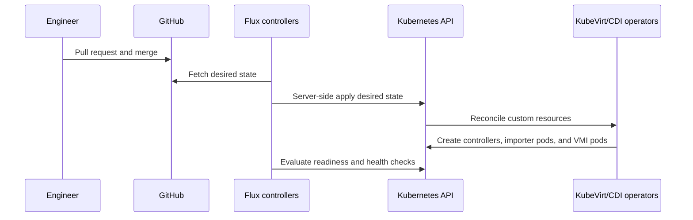
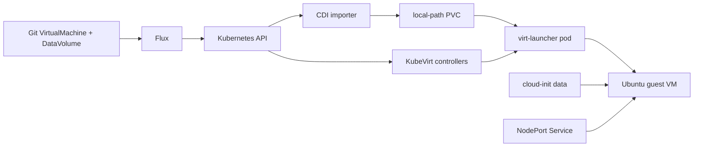

# Architecture

## Infrastructure layers

```mermaid
flowchart TB
  H[Windows 11 Home host] --> VB[Oracle VirtualBox 7.2]
  VB --> U[Ubuntu Server 24.04.4 LTS VM]
  U --> KVM[/dev/kvm nested acceleration]
  U --> K[K3s / Kubernetes 1.35]
  K --> F[Flux CD]
  K --> KV[KubeVirt]
  K --> CDI[CDI]
  K --> APP[Container workload]
  KVM --> KV
  KV --> VMI[Ubuntu guest VM]
  CDI --> DV[DataVolume and PVC]
  DV --> VMI
```

## Host-mode gate

```mermaid
flowchart LR
  BIOS[VT-x or AMD-V enabled] --> WIN{Microsoft hypervisor active?}
  WIN -- Yes --> DEG[Degraded/blocked accelerated path]
  WIN -- No --> VB[VirtualBox native VT-x/AMD-V]
  VB --> NEST[Nested hardware virtualization enabled]
  NEST --> KVM[/dev/kvm in Ubuntu]
  KVM --> READY[KubeVirt accelerated mode]
```

## GitOps reconciliation



## VM provisioning flow



## Design principles

- One outer Ubuntu VM and one Kubernetes node for the MVP.
- Hardware-assisted KVM is a gate, not an optional optimization.
- VirtualBox NAT and localhost forwards are the primary network path.
- Git controls desired Kubernetes state; it does not replace VM-disk backup.
- Local-path storage is acceptable for the MVP but is node-bound and not migration-capable.
- The lab documents production patterns without claiming production availability.
